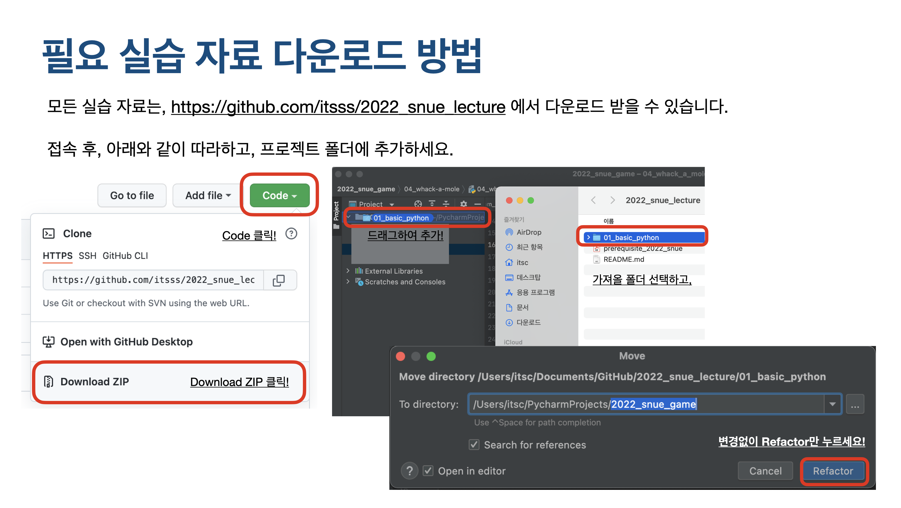

# 2022 서울교육대학교 소프트웨어영재교육원 'What is Computer Science?' 실습 자료 (2022.03.19)

## 강연 전 반드시 아래에 있는 설치 매뉴얼을 참조해서 PyCharm 을 설치하셔야 합니다. 소프트웨어 설치에 어려움을 겪는 경우 아래 연락처로 문의하여 문제를 해결합니다.
Contact: Taewon Kang (itschool [At] itsc [Dot] kr)

## PyCharm 설치 매뉴얼
**[바로가기](https://github.com/itsss/2022_snue_lecture/blob/main/prerequisite_2022_snue.pdf)**

## 강연 실습 자료 다운로드 방법
본 자료 내 Assignment 폴더에 있습니다. **(실습자료는 강연 당일 조회됩니다.)**

**Download ZIP 버튼을 눌러 실습자료를 다운받고, pycharm 프로젝트 내 폴더 전체를 드래그하여 사용하세요.**

## 설치를 전부 마쳤다면? (강연 전)
01_basic_python 폴더를 pycharm 내 폴더에 드래그 하여 추가하세요. 그리고 모든 예제를 실행해서 python 코드에 대해 이해해 보시기 바랍니다.

## 저에 대해 더 궁금하신가요?
* [Website](http://itsc.kr)
* [Facebook](https://www.facebook.com/itsc.kang/)

## Reference
* [pygame](https://pygame.org/)
